# IPTS - iCub Production Test Suite

IPTS is a test suite, configurable via .xml file, that allows to interact with test firmware loaded on boards to be tested.
Written in C# (.NET framework) , is a Windows Form application.
In this repo there are Visual Studio solution file, sources, and the installer project ([InnoSetup](https://jrsoftware.org/isinfo.php)) and output.

## Index (Indice)
- [Overview](#overview)
- [List of tested codes](#list-of-tested-codes)
- [1 Installation](#installation)
  - [1.1 Installing the test suite](#installing-the-test-suite)
  - [1.2 Installing ESD CAN-USB drivers](#installing-esd-can-usb-drivers)
  - [1.3 Configuring network interface](#configuring-network-interface)
- [2 Run IPTS](#run-ipts)
- [3 IPTS GUI description](#ipts-gui-description)
  - [3.1 Toolbar](#toolbar)
  - [3.2 Test mode](#test-mode)
  - [3.3 Testplan](#testplan)
  - [3.4 Run/Stop](#runstop)
  - [3.5 Log](#log)
- [Maintainers](#maintainers)

---

## Overview

IPTS is a test suite, configurable via .xml file, that allows to interact with test firmware loaded on boards to be tested.
Written in C# (.NET framework), it is a Windows Form application.
In this repo there are Visual Studio solution file, sources, and the installer project ([InnoSetup](https://jrsoftware.org/isinfo.php)) and output.

<strong>List of tested codes</strong>

Here is the list of the codes tested with the `IPTS` suite

IIT Code | Revisions | Description
-------- | ----------|----------
12008    | B,C       | MTB4, IIT - Electronic board for tactile sensor, with 3 axis accelerometers Vin 5Vcc
11996    | B,C       | STRAIN2, IIT - Electronic board, 6 channels strain gauges variable gain interface board with CAN/UART, Temperature sensor, IMU, STM32L4
5443     | D,E       | MC4-PLUS, IIT - Electronic board with cortex M4, Ethernet and power driver for 4 DC motors, SPI interface, 2 analog channels, 12-32V supply voltage, low brightness	
10004    | B         | MC4-PLUS_CSHAPE , IIT - Electronic Board
12024    | C         | RFE_MASTER, IIT - Electronic Board, Robot Face Expression Master board
14962    | D         | AMC_BLDC, IIT - Electronic board, single motor driver BLDC 12V-52V, 1 Arms, Hall sensors, incremental encoder, CAN/FD interface
2694     |           | 2224U012SR+IE2-512+2082 Faulhaber - Brush motor, encoder with 500mm cable lenght	
12264    |           | FAULHABER MOTOR 1016M012GK380+GEARBOX 10/1 i=16	
10347    |           | BLDC motor assembly, OD 49.2, ID 9.54, L 20.7, stack length 5.7, airgap diam 29.5	
10350    |           | BLDC motor assembly, OD 49.2, ID 9.54, L 27.7, stack length 12.7, airgap diam 29.5	
7117     |           | Moog BLDC motor, OD 49.2, ID 15.5, L 24.7 , W/O HALL SENSOR
7116     |           | Moog BLDC motor, OD 49.2, ID 15.5, L 17.7 , W/O HALL SENSOR
10182    |           | Moog BLDC motor, OD 72.4, ID 15.5, L 27.5 , W/O HALL SENSOR	

---

<strong>1 Installation</strong>

### 1.1 Installing the test suite

You can install **IPTS** on a Windows 10/11 machine.

:warning:
  **If the installer is required by suppliers or, in general, by external parties from IIT please refer to the installer attached in the provided release and DO NOT USE the link below**
  
- Download the installer from the [releases page](https://github.com/icub-tech-iit/ipts/releases)
- Run it and follow the wizard

### 1.2 Installing ESD CAN-USB drivers

`ESD CAN-USB` is an interface that allows to convert **USB** communications to **CAN** (and viceversa).
It is is used as communication interface between the test suite and the test firmware during the test.

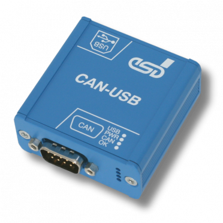

- Connect the **ESD CAN-USB** and run Device manager
- Right click on the device -> update driver

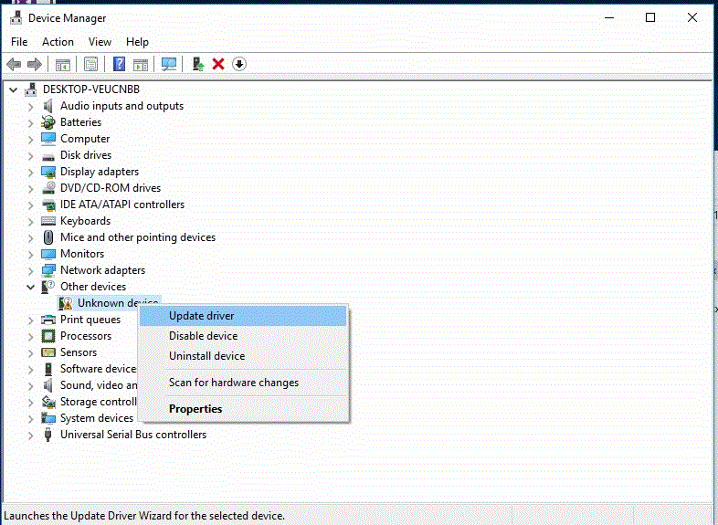

- Choose “browse my computer for driver software” option

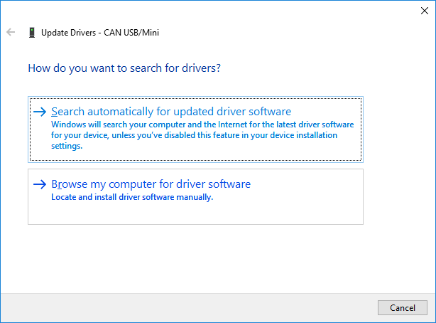

- Browse to ``[intallationPath]\tools\drivers_can`` (i.e. C:\Program Files (x86)\Istituto Italiano di Tecnologia\IPTS\tools\drivers_can) and correct drivers should be installed by Windows.

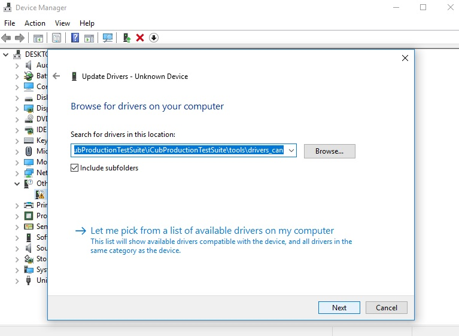

### 1.3 Configuring network interface

>This is necessary only for ETH boards (`mc4plus` and `mc2plus`).

To let `IPTS` testing the ethernet hardware we need to configure a network interface (also an `USB/ETH` adapter is good) with a fixed `ip address`.

Follow the steps below:

1. In `Control Panel` got to `Network and Internet`

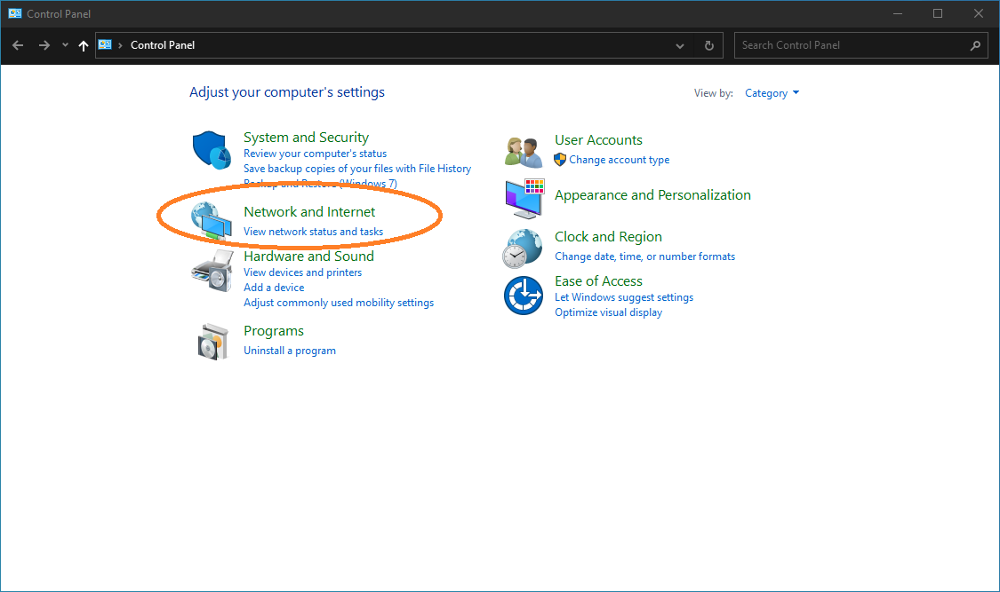

2. Select `Network and Sharing Center` 

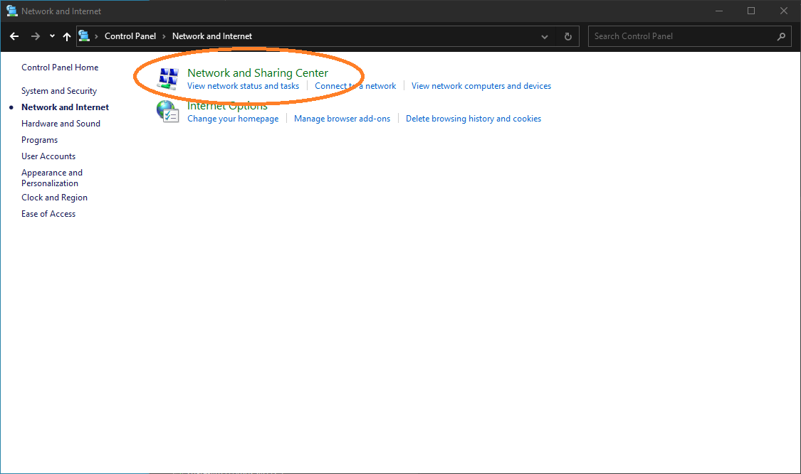

3. Select `Chnage adapter settings` 

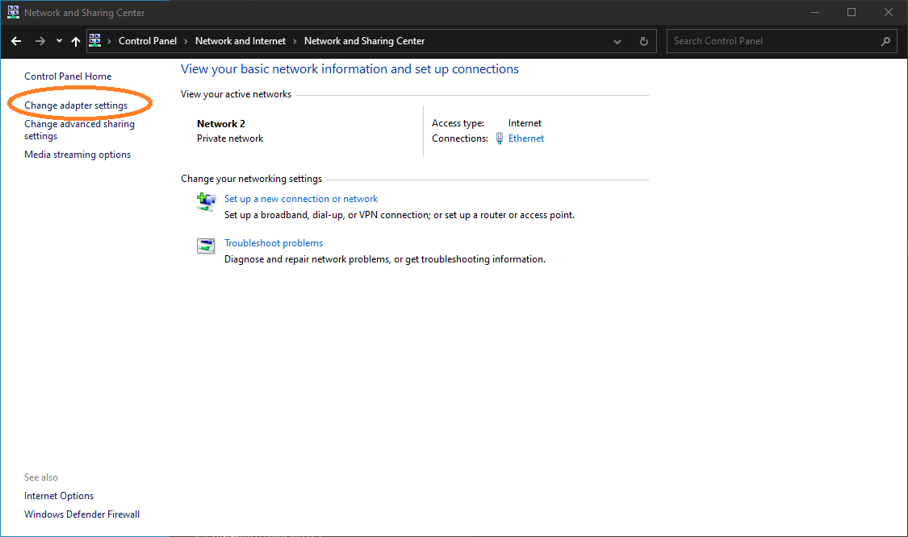

4. Right click on the desired network interface then select `Properties`

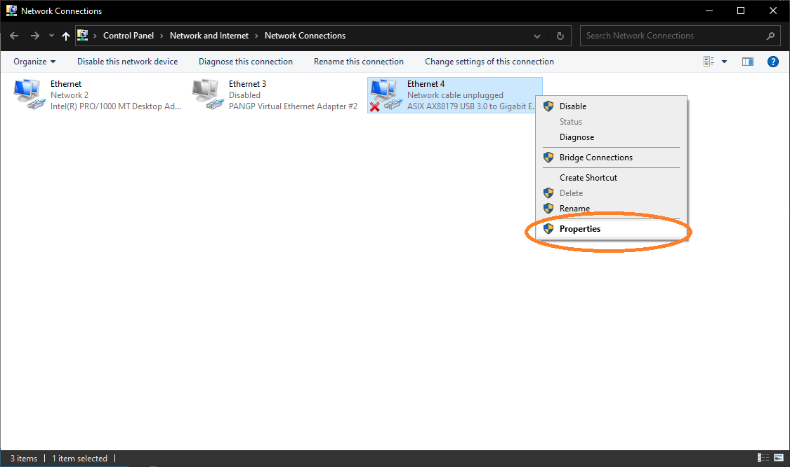

5. Select `Internet Protocol Version 4 (TCP/IPv4)` then click on `Properties`

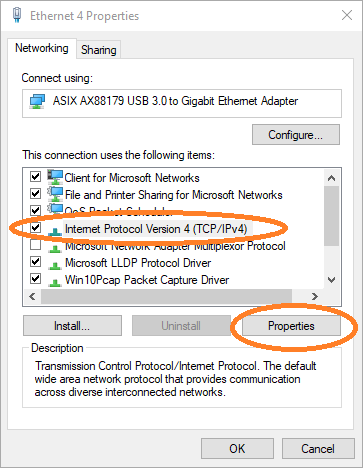

6. Select `Use the following IP address` and input the values as in figure below, then click `OK`

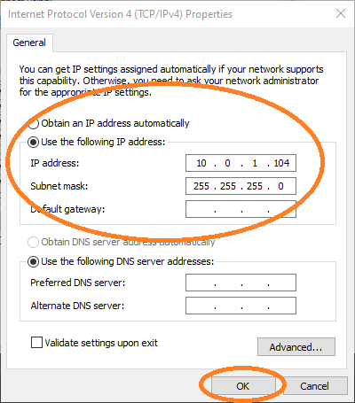

---

<strong>2 Run IPTS</strong>

- Launch the ``iCubProductionTestSuite.exe`` either from start menu, Desktop shortcut or installation folder with ***Administrator privileges***
- Enter the full operator’s name

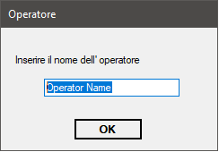

- Choose the board to be tested

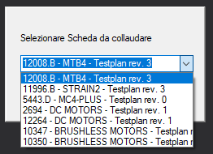

- Click ``Run`` and enter the **serial number**, then follow the instructions given by the software

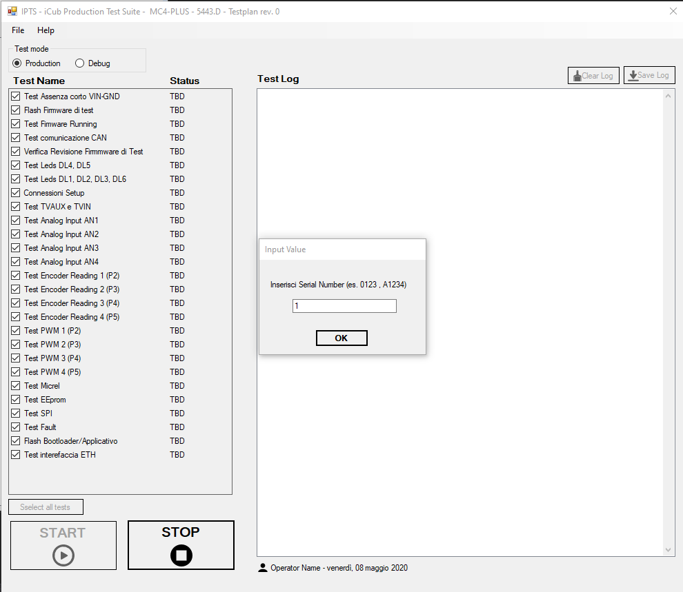

---

<strong>3 IPTS GUI description</strong>

This is the main GUI, here is a brief description of its functionalities

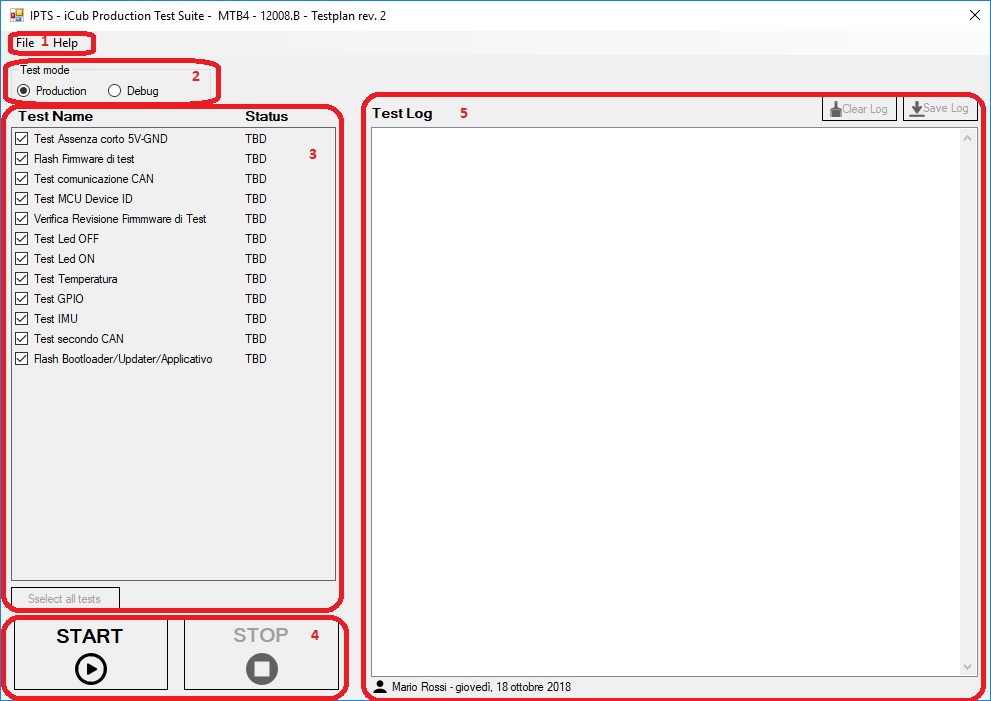

<strong>3.1 Toolbar</strong>

  - Under ``File`` you’ll find two options:

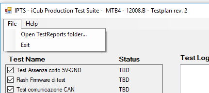

>
>- ``Open TestReports folder`` -> opens the folder containing all test reports
>- ``Exit`` -> quits the program

- Under ``Help`` youll’find About option that gives you info about software revision

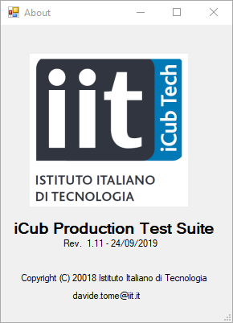

<strong>3.2 Test mode</strong>

- ``Production`` mode
  >In this mode you can’t check/uncheck tests to be executed; you will execute the whole testplan. At the and a report will be generated under ``PASS`` or ``FAIL`` subfolder in ``TesteReports`` fold[...] 

- ``Debug`` mode
  >In this mode you can check/uncheck tests to be executed; you will be able to choose which test or set of tests will be executed. At the and no report will be generated, anyway if you click on Save [...]

<strong>3.3 Testplan</strong>

>Here’s the list of all tests to be executed to validate the DUT.
The list of tetss is defined in the ``ipts.xml`` file.
If Debug mode is selected you can execute one or more tests by checking them.

<strong>3.4 Run/Stop</strong>

- ``Run``
  >starts tests execution

- ``Stop``
  >stops tests execution

<strong>3.5 Log</strong>

> Here you can read the log of testplan execution.
Once tests execution is competed the report will be saved in the ``TestReports`` folder.
``Save log`` and ``Clear log`` buttons will be enabled only in debug mode.
At the bottom youll’find info about operator name and date.

## Maintainers

This repository is maintained by:

| | |
|:---:|:---:|
|  | [@valegagge](https://github.com/valegagge) |
|  | [@MSEcode](https://github.com/MSECode) |
