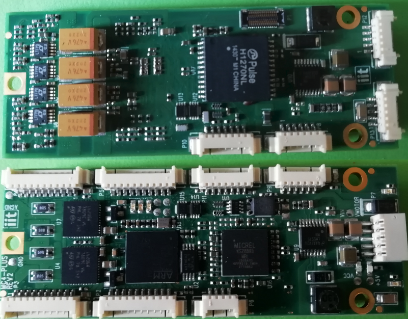

# MC4-PLUS - Test Firmware 

This repo contains the test firmware used by [IPTS](https://github.com/icub-tech-iit/proto/tree/master/proto-utils/ipts-test-suite) test suite.

---

## 1. Contents

The repo contains:

>- ``STM32 CubeMx`` project (to configure uP pheriperals and pins and create the project scheleton)
>- ``ARM Keil`` project

---

## 2. Firmware commands description

The test firmware loops waiting for a **8 byte lenght CAN message**.
 The MSB byte of the message corresponds to a test to be performed by the firmware or to a specifc action to be done.

>**TX message**    : d0=0x?? (??=command) , d1-d7= unused
>
>**RX message**     : d0=0x?? (??=AA -> test PASS, ??=BB -> test FAIL, ??=FF -> NOP) , d1-d7 = log messages (optional)

Here is the table containing the accepted commands and related responses

| Command | Deescription | Result |  |  |
|---|---|---|---|---|
| 0x00 | Get Firmware version | d1=Firmware version   d2=Firmware revision|  |  |
| 0x01 | Enables +5V | NOP |  |  |
| 0x02 | Disables +5V | NOP |  |  |
| 0x03 | Test Leds DL1,DL2,DL3,DL6| N/A |  |  |
| 0x04 | Test VIN| d0=0xAA or 0xBB (pass/fail)   d1=read>>8   d2=read |  |  |
| 0x05 | Test VAUX| d0=0xAA or 0xBB (pass/fail)   d1=read>>8   d2=read |  |  |
| 0x06 | Test analog input AN1| d0=0xAA or 0xBB (pass/fail)   d1=read>>8   d2=read |  |  |
| 0x07 | Test analog input AN2| d0=0xAA or 0xBB (pass/fail)   d1=read>>8   d2=read |  |  |
| 0x08 | Test analog input AN3| d0=0xAA or 0xBB (pass/fail)   d1=read>>8   d2=read |  |  |
| 0x09 | Test analog input AN4| d0=0xAA or 0xBB (pass/fail)   d1=read>>8   d2=read |  |  |
| 0x0A | Test EEprom U2| d0=0xAA or 0xBB (pass/fail) |  |  |
| 0x0B | Test Micrel U16| d0=0xAA or 0xBB (pass/fail)   d1=MICREL_FAMILY_ID   d2=MICREL_CHIP_ID   d3=MICREL_CHIP_ID_REV|  |  |
| 0x0C | Test SPI| d0=0xAA or 0xBB (pass/fail) |  |  |
| 0x0D | Test Encoder on P2| d0=0xAA or 0xBB (pass/fail)   d1=fail (0x01= index fal, 0x02= enc. reading fail) |  |  |
| 0x0E | Test Encoder on P3| d0=0xAA or 0xBB (pass/fail)   d1=fail (0x01= index fal, 0x02= enc. reading fail) |  |  |
| 0x0F | Test Encoder on P4| d0=0xAA or 0xBB (pass/fail)   d1=fail (0x01= index fal, 0x02= enc. reading fail) |  |  |
| 0x10 | Test Encoder on P5| d0=0xAA or 0xBB (pass/fail)   d1=fail (0x01= index fal, 0x02= enc. reading fail) |  |  |
| 0x11 | Test PWM on P2| d0=0xAA or 0xBB (pass/fail)   d1=MotorCurrentRead>>8 (PWM 90%)  d2=MotorCurrentRead (PWM 90%)   d3=MotorCurrentRead>>8 (PWM 10%)  d4=MotorCurrentRead (PWM 10%) |  |  |
| 0x12 | Test PWM on P3| d0=0xAA or 0xBB (pass/fail)   d1=MotorCurrentRead>>8 (PWM 90%)  d2=MotorCurrentRead (PWM 90%)   d3=MotorCurrentRead>>8 (PWM 10%)  d4=MotorCurrentRead (PWM 10%) |  |  |
| 0x13 | Test PWM on P4| d0=0xAA or 0xBB (pass/fail)   d1=MotorCurrentRead>>8 (PWM 90%)  d2=MotorCurrentRead (PWM 90%)   d3=MotorCurrentRead>>8 (PWM 10%)  d4=MotorCurrentRead (PWM 10%) |  |  |
| 0x14 | Test PWM on P5| d0=0xAA or 0xBB (pass/fail)   d1=MotorCurrentRead>>8 (PWM 90%)  d2=MotorCurrentRead (PWM 90%)   d3=MotorCurrentRead>>8 (PWM 10%)  d4=MotorCurrentRead (PWM 10%) |  |  |
| 0x15 | Test Fault ON| d0=0xAA or 0xBB (pass/fail) |  |  |
| 0x16 | Test Fault OFF| d0=0xAA or 0xBB (pass/fail) |  |  |
| 0x17 | Test CAN communication| d0=0xAA or 0xBB (pass/fail) |  |  |

---

## 3. Action/Tests not implemented in the firmware

The following tests and actions are performed outside the test firmware by the IPTS test suite

| Test/Action | tool | Description |  |  |
|---|---|---|---|---|
| Test Firmware Download | ST-LINK programmer/batch file (``mc4plus_test.bat``) | IPTS launch the script and check if the operation went sucessfully|  |  |
| Application Firmware Download | ST-LINK programmer/batch file (``mc4plus_prod.bat``) | IPTS launch the script and check if the operation went sucessfully|  |  |
| Test Ethernet Interface | batch file (``mc4plus_eth.bat``) | IPTS launch the script and check if the operation went sucessfully|  |  |
